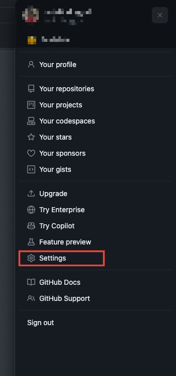
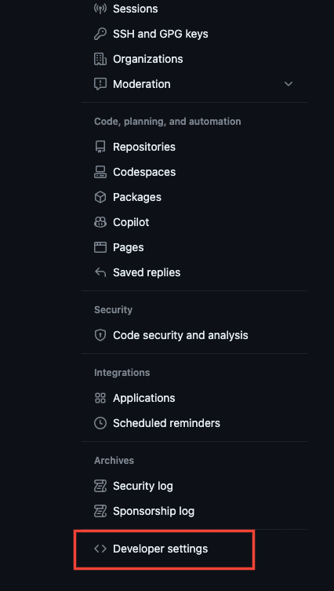
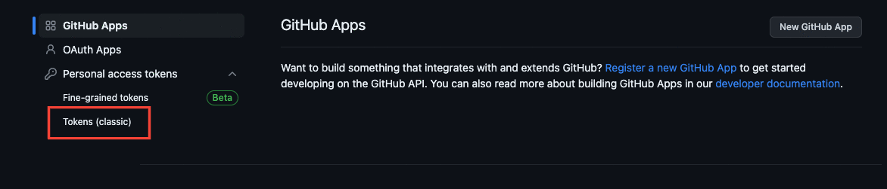
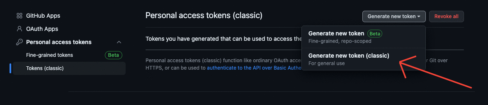
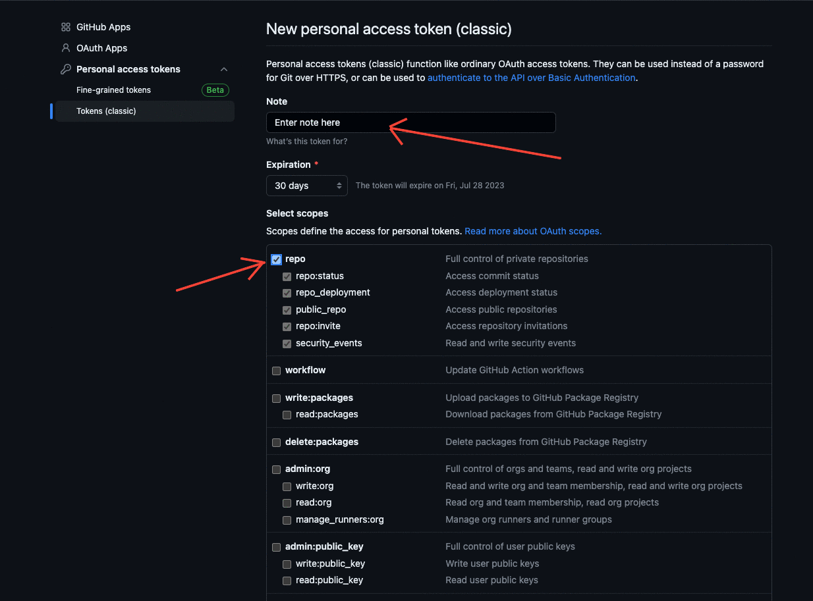

# PR Zipper

This extension is developed to download all the changed files in a PR of a repository at github with one click.

## Prerequisites

Before getting started, ensure that you have the following:

-   Node Version: 19.9.0

## Getting Started

Here are the steps for using this project:

-   Clone the repository and navigate to the project directory:

    ```
    cd PRs-Chrome-Extension
    ```

-   Install the necessary dependencies:

    ```bash
    npm install
    ```

-   Create build:

    ```bash
    npx webpack
    ```

## To Run the Extension:

-   Open chrome browser, click on the top right side button of extensions and then click manage extensions.

-   On the top right side turn on the developer mode.

-   Now you can see a button on the top left side named as "Load unpacked", click on it.

-   A dialog box will appear from there go to the location where you have placed the extension.

-   Get inside the extension folder and select folder named "dist" inside it.

-   An extension named "PR Zipper" will be added to your collection of extensions.

-   Pin the extension and click on the extension icon to add a personal access token (PAT) of your github account.

#### Note: To generate a personal access token (PAT) you need to follow these steps:

    - Go to the Github settings



    - Scroll down to the "Developer settings" and click on it.



    - Then click on "Personal access tokens" > "Tokens (classic)"



    - Click on "Generate new token" > "Generate new token (classic)".



    - Fill the required details like "Note" and "Expiration".

    - Under the scopes section do check mark on "repo".



    - Scroll down to click on generate token, do not forget to copy and paste this token to a safe place.

-   Now you have your PAT, so you can now click on the extension icon and fill the token to submit.

-   Once a valid token you have submitted, now you can visit any pull request page of a repository on github there you will see a new button on the right side of "files changed" named as "Download all changed files".


-   Click this button to download a zip file which when extracted will contain a folder named same as of your repository name and pull request number.

-   In that folder all the changed files will be present with the same file system as in the github repository.

#### Congratulations! now you can do this anytime with just 1 click
